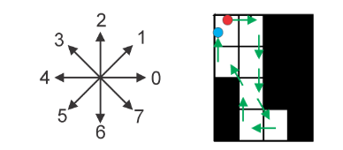

## Kamera z luknjico

Preslikava iz 3-D svetovnega koordinatnega sistema (poravnanega s kamero) (X,Y,Z) v 2-D koordinatni sistem slike (x,y)

- perspektivna transformacija - $ (X, Y, Z) -> (x, y) $

  $ x = -f\dfrac{X} {Z} $

  $ y = -f\dfrac{Y} {Z} $


### Velikost predmeta na sliki

Kockasta škatla z velikostjo stranice 10𝑐𝑚 z majhno odprtino na pred- nji strani deluje kot kamera z luknjico. Usmerimo jo proti drevesu, ki je od kamere oddaljeno 14𝑚. Kako velika je slika drevesa, ki nastane na zadnji strani škatle, če je drevo visoko 5𝑚?


$f = 10 cm $

$Z = 1400 cm$

$ X = 500 cm$

$ x = ? $


$ x = -f\dfrac{X} {Z} $

$ x = -10\dfrac{500} {1400} $

$ x = 3.5714285714285716 cm$ 


---


### Velikost predmeta v realnosti

S kamero z goriščno razdaljo 𝑓 = 60𝑚𝑚 posnamemo sliko vertikalnega valja, ki je od kamere oddaljen 95𝑚. Določi višino valja, če v digitalizirani obliki slika valja po višini zavzame 200 slikovnih elementov. Ločljivost tipala je 2500 DPI.


$f = 6 cm $

$d = 9500 cm$

$ x = 200 dots $

$ senzor = 2500 DPI $

$ X = ? $


> $ 1 inch = 2.54 cm $

$ x = \dfrac{200}{2500} 2.54 = 0.20320000000000002 cm $

$X = \dfrac{z*x}{f} = \dfrac{9500 * 0.20320000000000002}{6}  = 321.7333333333333 cm$


## Morfološki filtri

- linearni filtri ne spreminjajo toplogije slike
- medianin filter deloma spremeni strukturo slike


## Verižne kode



### Absolutna verižna koda

- ni invariantna na začetno pozicijo in rotacijo

`0 6 6 7 4 2 3 2 `


### Diferenčna verižna koda

- invariantna na rotacijo 
- ni invariantna na začetno pozicijo

```
absolutna:        0     6     6     7     4     2     3     2

diferenčna:     (6-0) (6-6) (7-6) (4-7) (2-4) (3-2) (2-3) (0-2)
				  6      0    1     -3    -2    1     -1    -2
mod 8:   		  6      0    1      5     6    1      7     6
```

`6 0 1 5 6 1 7 6`


### Normalizirana diferenčna Freemanova verižna koda

- invariantna na začetno pozicijo in rotacijo


Difernečno verižno kodo rotiramo tako, da dobimo najnižjo ali najvišjo 
desetiško vrednost.


```
diferenčna:  6 0 1 5 6 1 7 6
normalizirana:           7 6 6 0 1 5 6 1
```


## Geometrične značilnice

### Obseg $ P(R) $

- pri 4 sosednosti bo dolžina večja od dejanske, zato ponavadi uporabljamo 8-sosedno verižno kodo


```python
perimeter = 0
for e in chain:
	if e in [0, 2, 4, 6]:
		perimeter += 1
	elif e in [1, 3, 5, 7]:
		perimeter += sqrt(2)
		
# normalization		
perimeter = 0.95 * perimeter
```


### Površina $ A(R) $

- število slikovnih elementov v regiji
- lahko jo ocenimo tudi iz obrisa


### Kompaktnost oz. okroglost $ Circularity(R) $

$ Circularity(R) = 4 * pi * \frac{A(R)}{P^2(R)}$

### Centroid

- Težišče regije
- Aritmetična vsota koordinat v smereh x in y


$x' = \dfrac{1}{|R|} \sum_{(u, v) \in R}^{} u$

$y' = \dfrac{1}{|R|} \sum_{(u, v) \in R}^{} v$

$ |R| = Area(R)$ 
$u = št. vrstice$ 
$v = št. stolpca$ 


### Momenti

- za binarne slike

$m_{p,q} = \sum_{(u, v) \in R}^{} u^p v^q$


#### Površina

$ A(R) = m_{0, 0} $


#### Centroid

$ x' = \dfrac{m_{1,0}(R)} {m_{0,0}(R)} $

$ y' = \dfrac{m_{0,1}(R)} {m_{0,0}(R)} $


#### Centralni moment

- centralni moment ni odvisen od položaja regije na sliki

$m_{p,q} = \sum_{(u, v) \in R}^{} (u - x')^p (v-y')^q$

*od vsake id vrstice (u) in id stolpca (v) odšteješ koordinate od centra*


## Filtriranje

- ne spremeni geometrije slike
- uporabi več kot en pixel za izračun vrednosti novega pixla


### Linearni filtri

Kombinirajo vrednosti slikovnih elementov s filtrirane regije na linearen način kot uteženo vsoto

povprečni, gaussov

- filtri za glajenje

  - vsi koeficienti so pozitivni
  - zgladijo, zamažejo originalno sliko
  - zmanjšajo gaussov šum

- diferenčni filtri

  - imajo tudi negativne koeficiente

  - poudarijo lokalne spremembe v intenziteti

    ​

- Konvolucija je  operacija filtriranja z (horizontalno in vertikalno) zrcaljeno 
  matriko filtra

- Konvolucijsko jedro je ločljivo, če ga lahko izrazimo kot konvolucijo 
  večih jeder


### Nelinearni filtri

- min in max filter
- medianin filter
- uteženi medianin filter


## Detekcija robov


### Canny

1. Zmanjštevanje šuma
  - glajenje z Gaussovim filtrom
2. Računanje gradienta
  - Aplicira se linearni gradientni filter za iskanje robov (npr. Sobelov)
  - Izračuna se magnituda in smer roba (ki se zaokroži na enega 
    od štirih kotov (0, 45, 90 in 135 stopinj))
  - Magnitude se upragovi, da dobimo sliko robov
3. Dušenje lokalnih ne maximumov
  - tanjšanje robov
  - Preveri velikosti magnitude dveh sosednjih elementov v smeri 
    gradienta; če vrednost trenutnega slikovnega elementa ni 
    največja, jo postavi na nič
4. Sledenje robov z upragovanjem na osnovi histerez
  - Rob se začne slediti, če je magnituda večja od T1 in se sledi 
    vse dokler ni manjša od T2

