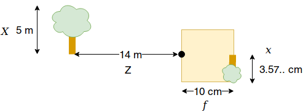
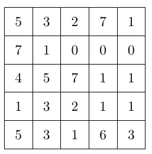
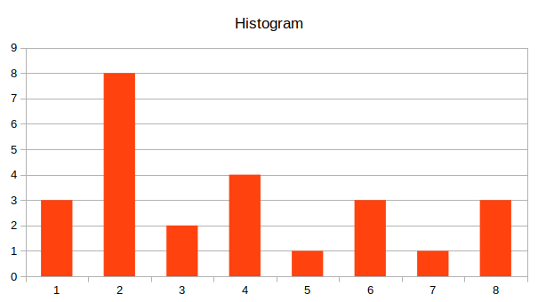
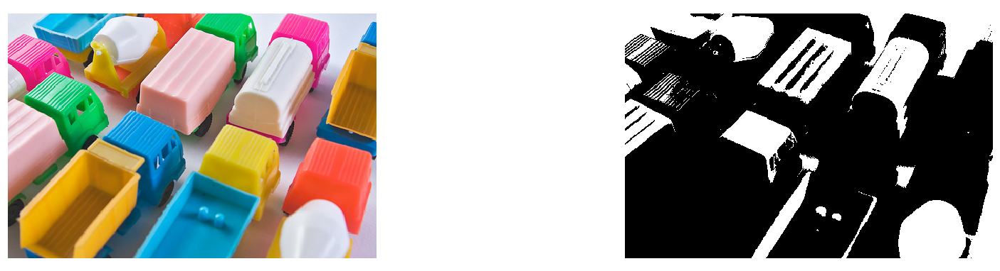
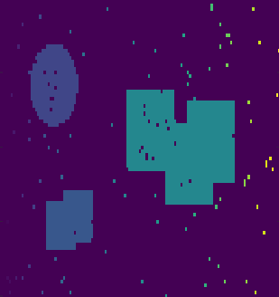

# Vaja 1


## 1. Naloga: kamera

### a) 



$f = 10 cm $

$d = 1400 cm$

$ X = 500 cm$

$ x = ? $


$ x = -f\dfrac{X} {Z} $

$ x = -10\dfrac{500} {1400} $

$ x = 3.5714285714285716 cm$ 


### b) 

$ d = \dfrac{1}{2}a t^2 $


### c) 

#### Kamera z luknjico

Problem kamere z luknjico je, da mora biti luknjica za ostro sliko zelo majhna.
Zaradi majhne luknjice pa potrebuje dolg čas ekspozicije.


#### Kamera z lečo

Leča omogoča, da več žarkov svetlobe iz iste točke objekta pade na isto točko
na sliki. Zaradi tega imamo lahko večjo luknjico, krajši čas ekspozicije, pri tem
pa se še vedno ohrani ostrina slike. 

Leča lahko zaradi svoje ukrivljenosti popači sliko, v skrajnem primeru dobimo
_fish eye_ efekt.


### d)

$f = 6 cm $

$d = 9500 cm$

$ x = 200 dots $

$ senzor = 2500 DPI $

$ X = ? $


> $ 1 inch = 2.54 cm $

$ x = \dfrac{200}{2500} 2.54 = 0.20320000000000002 cm $

$X = \dfrac{z*x}{f} = \dfrac{9500 * 0.20320000000000002}{6}  = 321.7333333333333 cm$


## 2. Naloga: Procesiranje slik

### g)

Getting camera image

- install **image-acquisition** `pkg install -forge image-acquisition`

- load installed package `pkg load image-acquisition`

```
  pkg load image-acquisition

  obj = videoinput("v4l2", "/dev/video0")
  set(obj, "VideoFormat", "RGB3");  % To convert video format from RGB24 to RGB3
  start(obj, 1) % Start streaming with two buffers

  for idx = 1:100
     % Acquire a single image.
     rgbImage = getsnapshot(obj);
     imshow(rgbImage);   
     drawnow
  end
  stop(obj);
```

sources
- [Getting image into octave from camera](https://lifearoundkaur.wordpress.com/2015/07/11/getting-an-image-into-octave-from-a-local-camera/])
- [Acquire webcam images in a loop](https://www.mathworks.com/help/supportpkg/usbwebcams/ug/acquire-webcam-images-in-a-loop.html)


## 3. Naloga: histogram

### a)



Histogram v obliki tabele:

|  3   |  8   |  2   |  4   |  1   |  3   |  1   |  3   |
| :--: | :--: | :--: | :--: | :--: | :--: | :--: | :--: |
|  0   |  1   |  2   |  3   |  4   |  5   |  6   |  7   |





Kumulativni histogram:

|  3   |  11  |  13  |  17  |  18  |  21  |  22  |  25  |
| :--: | :--: | :--: | :--: | :--: | :--: | :--: | :--: |
|  0   |  1   |  2   |  3   |  4   |  5   |  6   |  7   |


Histogram, če bi bila slika 4-bitna:

`3 8 2 4 1 3 1 3 0 0 0 0 0 0 0 0`


### b)

> rgb2gray needs pkg image
>
> - download file from https://octave.sourceforge.io/image/
> - run `pkg install image-2.6.1.tar.gz`
> - add `pkg image` to the start of script


#### Hist stretch

$g(x,y) = \dfrac{f(x, y) - fmin}{fmax -fmin} 255$

> *source http://www.tutorialspoint.com/dip/Histogram_Stretching.htm*


### d)

Otsujeva metoda deluje dobro takrat, ko ima histogram dva izrazita, ločena dela *(temen in svetel del na sliki)* in lahko zato histogram enostavno razpolovi na dva dela.


## 4. Naloga: barvni prostori

### b)



Upragovanje po modri barvi s pragom `Blue > 200` ni dalo kvalitetne segmentacije modrih regij. 
Problem je v tem, da bela barva vsebuje polno modro komponento, prav tako pa veliko modre komponente
vsebujejo tudi nekatere druge barve. Upragovanje pa medtem ni vključilo temno modre barve, ker ima le ta
manj modre komponente od praga.


## 5. Regije in morfološke operacije

### b) *morfološke operacije*



Iz slike dobimo 77 regij. Večina izmed regij je šum, zato so le te zelo majhne.